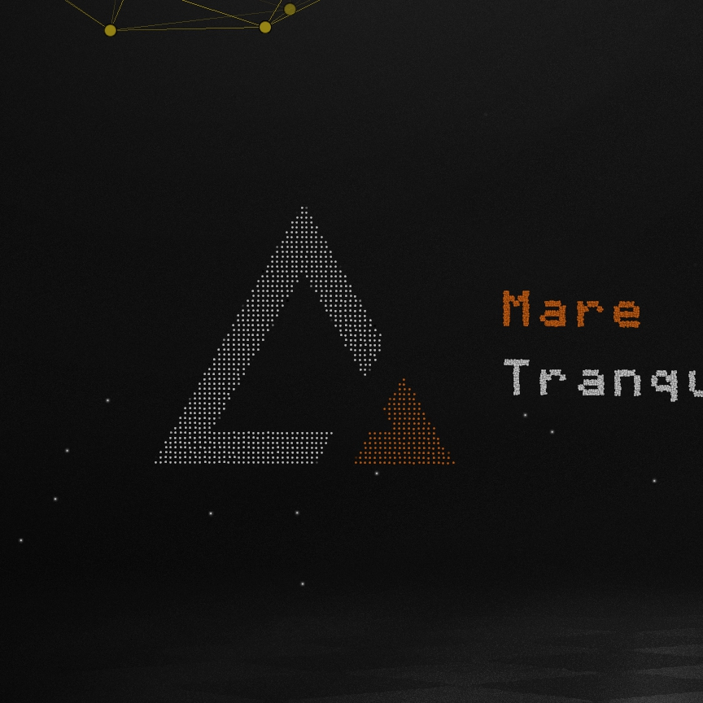

# 基于明日方舟官网制作的动态粒子壁纸

[](https://store.steampowered.com/app/431960/Wallpaper_Engine/)
[](https://ak.hypergryph.com/)

> steam创意工坊:https://steamcommunity.com/sharedfiles/filedetails/?id=3486243270



## [功能特性]
- **更改/自定义粒子图案**
- **更改光标外边框**
- **⚠️**: 由于wallpaper与代码的原因,只能通过切换壁纸才能应用对壁纸的设置

## [json格式]
```
// 粒子配置
{
  "count": 4237,  //粒子数量,上线为10000
  "size": {
    "width": 490,  //宽(x)
    "height": 198  //高(h)
  },
  "points": [  //粒子生成位置及颜色(rgba)
    [147,6,"#f2f2f25f"],
    [150,6,"#f2f2f25f"],
    ...
  ]
}
```
- **后续**: 后续会更新外置图片转json脚本

## 关于
- **源码**: https://steamcommunity.com/sharedfiles/filedetails/?id=2447798562
